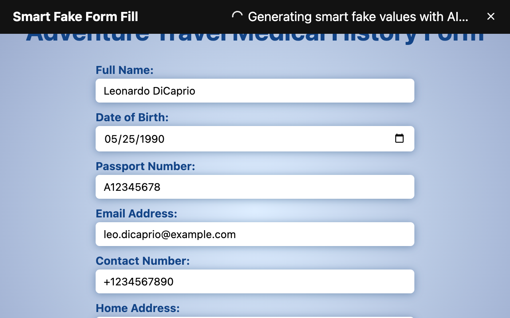

# Smart Fake Form Fill

_Copyright 2024-2025 Caleb Evans_  
_Released under the MIT license_

Smart Fake Form Fill is Chrome extension that enables developers to populate forms with relevant, AI-generated data for testing purposes.

[Install from the Chrome Web Store][web-store]

[web-store]: https://chromewebstore.google.com/detail/ljhoabhcjeffcmaafbhncljjmffpjmfi

## Quick Start

1. Install the extension
2. Enter your OpenAI API key ([visit OpenAI to obtain one][api-dashboard])
3. Right-click a form and choose "Smart Fake Form Fill"

You can also choose which model you'd like to use, as well as specify custom
instructions for the model, all in the Extension Options.

[api-dashboard]: https://platform.openai.com/api-keys




## Developer Setup

### Build project

Once you've cloned the project, you must install dependencies and build the
extension using your preferred package manager (like npm, yarn, or pnpm):

```sh
pnpm install
pnpm build
```

### Install from Chrome

Once the extension is built, open [chrome://extensions](chrome://extensions) and
enable **Developer mode** in the top-right corner.

Once you see the Developer Mode toolbar appear, click the "Load unpacked"
button, then choose the `dist/` directory in the repository.

When the extension is installed, you'll need to enter your OpenAI API key to
start using the extension.
