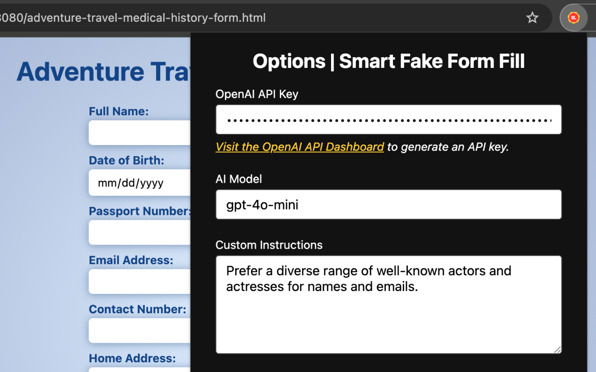

# Smart Fake Form Fill

_Copyright 2024 Caleb Evans_  
_Released under the MIT license_

Smart Fake Form Fill is a developer-oriented Chrome extension for populating
forms with relevant, AI-generated data. This is different from other fake data
form-filling extensions, which require you to specify field types, and which
don't understand the semantics of the fields they are populating.

Rather, this extension will send all form metadata (labels, formats, etc.) to
the LLM so it can produce more realistic fake data (as counterintuitive as that
sounds). If your data needs to follow specific rules, you can also specify
custom instructions to send directly to the LLM.

Currently, this extension only supports OpenAI models (`gpt-4o-mini` or `gpt-4o`). When you install the extension, you will be prompted to enter your
OpenAI API key (which is required for this extension to operate).

## Quick Start

1. Install the extension
2. Enter your OpenAI API key ([visit OpenAI to obtain one][api-dashboard])
3. Right-click a form and choose "Smart Fake Form Fill"

You can also choose which model you'd like to use, as well as specify custom
instructions for the model, all in the Extension Options.

[api-dashboard]: https://platform.openai.com/api-keys




## Developer Setup

### Build project

Once you've cloned the project, you must install dependencies and build the
extension using your preferred package manager (like npm, yarn, or pnpm):

```sh
pnpm install
pnpm build
```

### Install from Chrome

Once the extension is built, open [chrome://extensions](chrome://extensions) and
enable **Developer mode** in the top-right corner.

Once you see the Developer Mode toolbar appear, click the "Load unpacked"
button, then choose the `dist/` directory in the repository.

When the extension is installed, you'll need to enter your OpenAI API key to
start using the extension.
